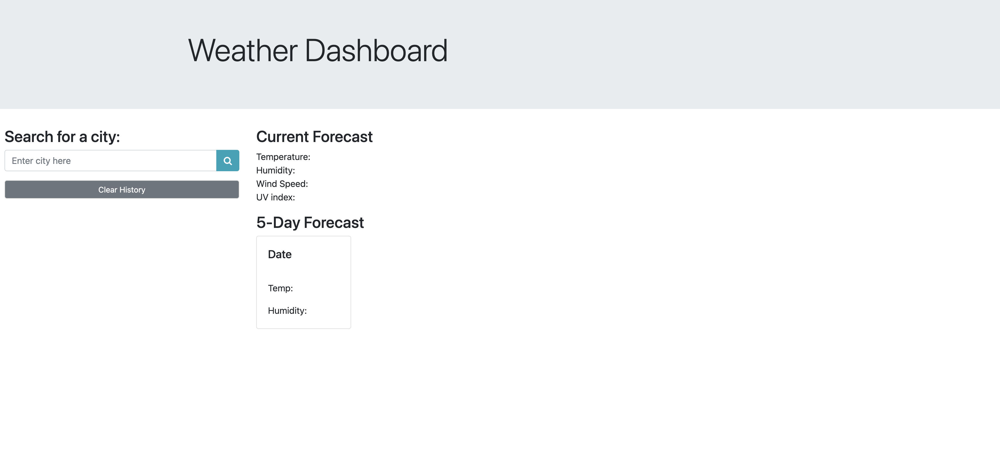
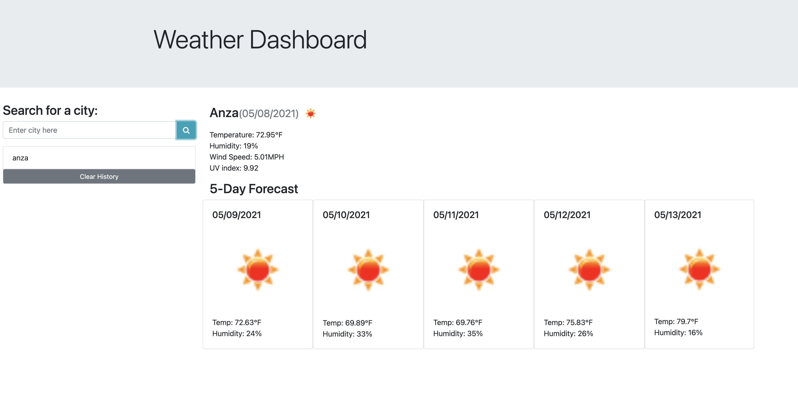
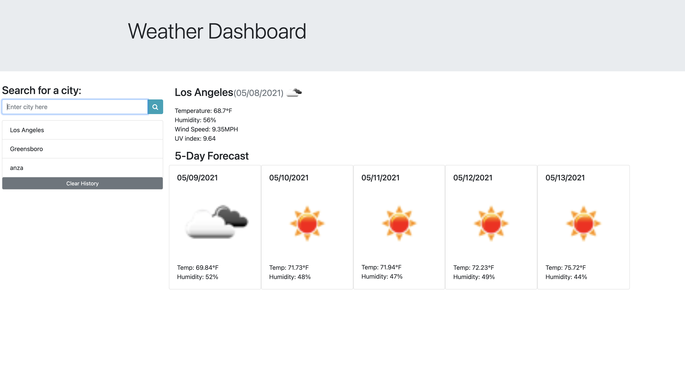
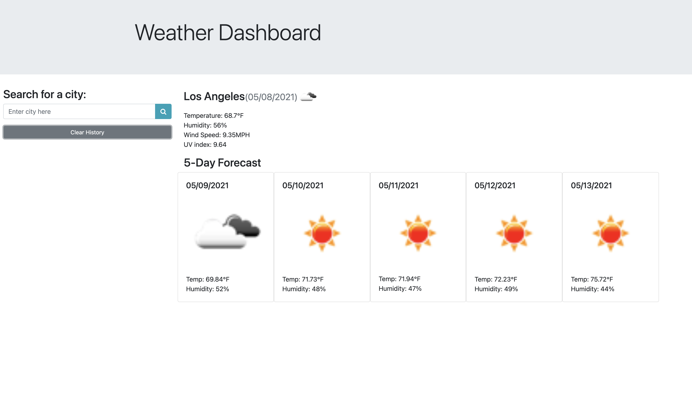

# 06 Server-Side APIs: Weather Dashboard

## My Task...

Third-party APIs allow developers to access their data and functionality by making requests with specific parameters to a URL. Developers are often tasked with retrieving data from another application's API and using it in the context of their own. Your challenge is to build a weather dashboard that will run in the browser and feature dynamically updated HTML and CSS.

Use the [OpenWeather One Call API](https://openweathermap.org/api/one-call-api) to retrieve weather data for cities. Read through the documentation for setup and usage instructions. You will use `localStorage` to store any persistent data.


## The Acceptance Critieria I met...

```
GIVEN a weather dashboard with form inputs
WHEN I search for a city
THEN I am presented with current and future conditions for that city and that city is added to the search history
WHEN I view current weather conditions for that city
THEN I am presented with the city name, the date, an icon representation of weather conditions, the temperature, the humidity, the wind speed, and the UV index
WHEN I view future weather conditions for that city
THEN I am presented with a 5-day forecast that displays the date, an icon representation of weather conditions, the temperature, the wind speed, and the humidity
WHEN I click on a city in the search history
THEN I am again presented with current and future conditions for that city
```
## The Acceptance Criteria I did not meet...

```
WHEN I view the UV index
THEN I am presented with a color that indicates whether the conditions are favorable, moderate, or severe
```

## My Webpage...

Here is my link: [Weather Dashboard](https://snk923.github.io/homework6-weather-dashboard/)

The following images demonstrate the webpages's appearance and functionality:









