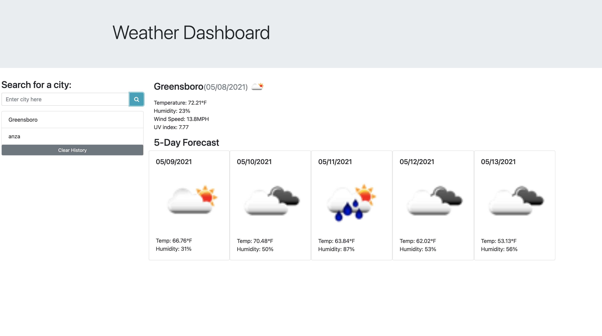

# Weather Dashboard

#### https://savvykolb.github.io/weather-dash/

#### https://github.com/savvykolb/weather-dash

## Project Description:

An application called Weather Dashboard utilizes a third-party API to retrieve weather data for cities. 

## Questions

If you have questions about this application please email: Savannahnkolb@gmail.com
Or visit my Github profile: https://github.com/savvykolb

